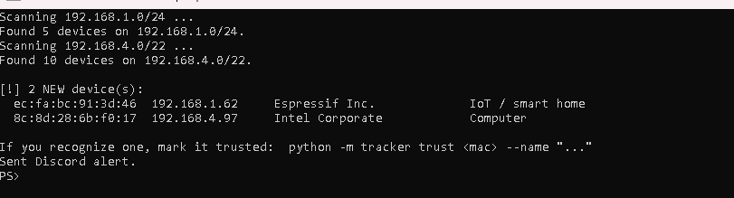
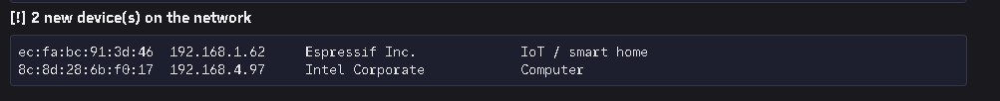
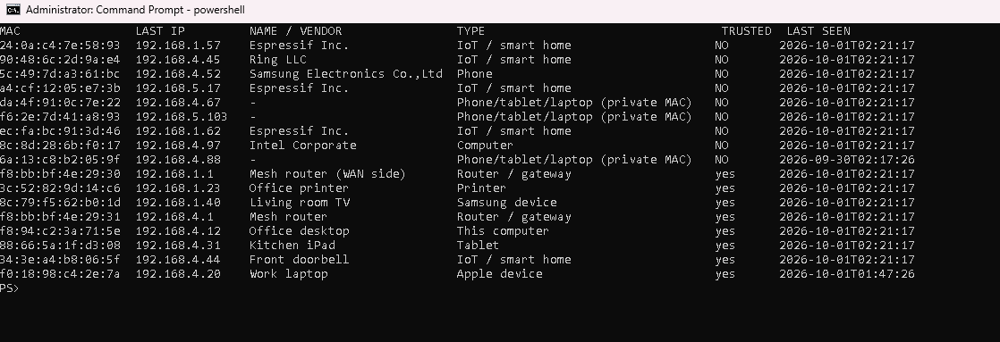
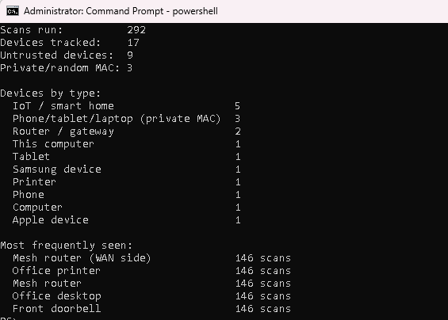
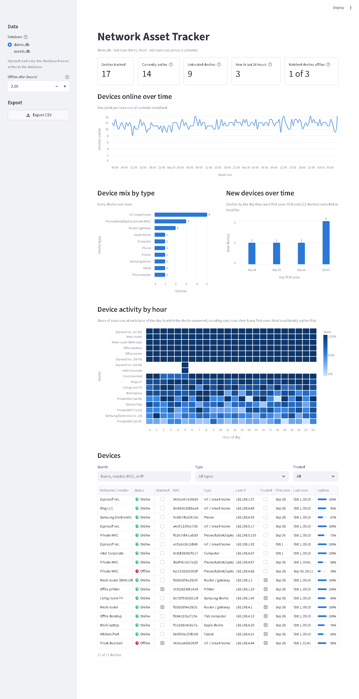

# Network Asset Tracker

A Python tool that automatically discovers every device on a local network, identifies who made it and what it probably is, keeps a history in SQLite, and flags devices it hasn't seen before.

Think of it as a lightweight version of the asset discovery tools IT teams use to answer "what's actually on our network?"

## Screenshots

All screenshots use the built-in demo data (`python -m tracker demo`), so the devices and MAC addresses shown are fake.

**Scan:** an ARP sweep finds every device and flags the ones it hasn't seen before.



**Alert:** new devices are posted to a Discord channel through a webhook.



**List:** every device ever seen, with vendor, type, last IP, and trust status.



**Report:** summary stats across all scans.



**Dashboard:** KPIs, devices online over time, device mix, new devices per day, an hourly activity heatmap, and a searchable device table, in a Streamlit app.



## What it does

- **Discovers devices** with an ARP sweep of the subnet (catches devices that ignore ping)
- **Identifies the manufacturer** from the MAC address's OUI prefix, offline
- **Guesses the device type** (phone, printer, smart home / IoT, router, TV, etc.) from vendor and hostname
- **Detects randomized "private" MAC addresses** used by modern phones, so they're labeled instead of just showing as unknown
- **Tracks history over time**: first seen, last seen, and every IP a device has used
- **Flags new devices** after each scan, and lets you mark known ones as trusted
- **Runs unattended**: scheduled scans, a log file, and Discord alerts for new devices
- **Tracks online/offline status**: alerts when a watched device drops off the network or comes back, and flags scans that look unreliable instead of reporting false outages
- **Dashboard**: a Streamlit app with device trends, an hourly activity heatmap, and CSV export for Power BI or Excel

## Skills demonstrated

- **Python**: a modular command-line package (`python -m tracker`) built with argparse
- **SQLite schema design**: normalized `devices`, `scans`, and `sightings` tables that keep a full history
- **ARP / networking**: subnet sweeps, multi-subnet scanning, double NAT, and gateway detection
- **scapy**: crafting and sending raw ARP packets
- **Windows Task Scheduler**: unattended scans every 30 minutes, set up by a PowerShell script
- **Webhook integration**: Discord alerts for new devices, with the URL kept out of the code
- **Data visualization**: a Streamlit, pandas, and Altair dashboard that reads the database read-only
- **IoT device identification**: OUI vendor lookup, randomized-MAC detection, and spotting smart home devices by their Wi-Fi module maker

## Setup

Requires Python 3.10+.

```bash
pip install -r requirements.txt
python -m tracker update-vendors     # one-time download of the manufacturer list
```

**Windows:** scapy needs [Npcap](https://npcap.com/) to send raw packets. Install it (check "WinPcap API-compatible mode"), then run your terminal **as Administrator**.

**Mac / Linux:** raw packets need root, so run scans with `sudo`:

```bash
sudo python3 -m tracker scan
```

## Usage

```bash
python -m tracker scan                          # scan and flag new devices
python -m tracker scan --subnet 192.168.0.0/24  # if auto-detect picks the wrong network
python -m tracker list                          # every device ever seen, online/offline
python -m tracker trust aa:bb:cc:dd:ee:ff --name "Living room TV"
python -m tracker watch aa:bb:cc:dd:ee:ff       # alert when it goes offline / comes back
python -m tracker unwatch aa:bb:cc:dd:ee:ff
python -m tracker report                        # summary stats
python -m tracker test-alert                    # send a test Discord message
```

The subnet is auto-detected by assuming a /24 around your machine's IP. Check yours with `ipconfig` (Windows) or `ifconfig` (Mac).

### Scanning more than one subnet

`--subnet` takes one or more networks. Each subnet gets its own scan record, and new devices from all of them are listed together at the end:

```bash
python -m tracker scan --subnet 192.168.1.0/24 192.168.4.0/22
```

This is useful with double NAT (e.g. an ISP router plus your own mesh system), where devices are split across two networks. ARP doesn't cross routers, so a subnet only returns devices if this computer is directly connected to it (for example, Ethernet to one router and Wi-Fi to the other). The scanner sends out whichever adapter routes to each subnet.

In each subnet, the first host address (`.1`, or `192.168.4.1` for eero) is labeled "Router / gateway", and this computer's own adapters are labeled "This computer".

### Demo data (for screenshots)

To show the tool without exposing a real network, build a database of fake devices and point any command at it with `--db`:

```bash
python -m tracker demo                        # creates demo.db
python -m tracker --db demo.db scan           # simulated scan, no packets sent
python -m tracker --db demo.db list
python -m tracker --db demo.db report
python -m tracker --db demo.db test-alert     # sample Discord alerts with demo devices
```

`demo.db` holds 15 made-up devices across two subnets with three days of scan history. Three of them are watched, and one (the front doorbell) dropped off the network 3.5 hours before the last scan, so it shows as offline. The MACs are fake but use real vendor prefixes, so they're classified like real ones. A scan against a demo database never touches the network: it replays the devices from the last scan, and the first one "finds" two new devices. Run `demo` again to reset it. The command refuses to overwrite `assets.db` or any database it didn't create.

## Automated monitoring (Phase 2)

Set the tracker up to scan on its own every 30 minutes, log what it did, and ping you on Discord when something new joins the network.

### 1. Config file

So scheduled runs don't need long command lines, put your subnets and timeout in `config.json` in the project folder:

```bash
copy config.example.json config.json     # Mac/Linux: cp
```

```json
{
  "subnets": ["192.168.1.0/24", "192.168.4.0/22"],
  "timeout": 2,
  "offline_after_hours": 2
}
```

All keys are optional. `offline_after_hours` is explained in [Offline tracking](#offline-tracking-and-watched-devices). Command-line arguments always win, so `python -m tracker scan --subnet 10.0.0.0/24` ignores the file's subnets. Use `--config path\to\other.json` to read a different file. `config.json` is gitignored; `config.example.json` is the committed template.

### 2. Discord alerts

After each scan, if any new devices were found, the tracker posts them (MAC, IP, vendor, type) to a Discord channel. New devices are always untrusted until you run `trust` on them. It also alerts when a [watched device](#offline-tracking-and-watched-devices) goes offline or comes back, and when a scan looks unreliable.

1. In Discord: **Server Settings > Integrations > Webhooks > New Webhook**, pick a channel, and **Copy Webhook URL**.
2. Save it as a user environment variable. The URL is never stored in the code or config, because anyone who has it can post to your channel.

   ```powershell
   setx DISCORD_WEBHOOK_URL "https://discord.com/api/webhooks/..."
   ```

   `setx` only affects **new** terminals, so open a new one afterwards. (Mac/Linux: `export DISCORD_WEBHOOK_URL=...` in your shell profile.)
3. Check it works:

   ```bash
   python -m tracker test-alert
   ```

If `DISCORD_WEBHOOK_URL` isn't set, scans skip alerts silently. If Discord can't be reached, the scan still finishes and the error goes to the log.

### 3. Scheduled scans (Windows)

From a PowerShell window opened **as Administrator**, in the project folder:

```powershell
powershell -ExecutionPolicy Bypass -File scripts\install_task.ps1
```

This creates a Task Scheduler task called `AssetTrackerScan` that:

- runs `python -m tracker --log logs\scan.log scan` every 30 minutes (change it with `-IntervalMinutes 15`)
- runs with highest privileges, which scapy/Npcap needs to send raw packets
- uses the project folder as its working directory, so it picks up `assets.db` and `config.json`
- uses `pythonw.exe`, so no console window pops up
- only runs while you're signed in, which is how it gets your `DISCORD_WEBHOOK_URL`

Run it once right away, and confirm it's there:

```powershell
Start-ScheduledTask -TaskName AssetTrackerScan
Get-ScheduledTaskInfo -TaskName AssetTrackerScan    # LastTaskResult 0 = success
```

To remove it (your database, config, and logs are kept):

```powershell
powershell -ExecutionPolicy Bypass -File scripts\uninstall_task.ps1
```

If you set `DISCORD_WEBHOOK_URL` after signing in, the scheduled task may not see it until you sign out and back in.

### 4. Logs

Scheduled runs append their output to `logs\scan.log`, with a timestamped header per run, so you can see what happened while you weren't watching. Errors and crashes are logged too. Once the file passes about 1 MB it's moved to `logs\scan.log.1` and a fresh one is started. The `logs/` folder is gitignored.

```powershell
Get-Content logs\scan.log -Tail 30          # latest runs
Get-Content logs\scan.log -Wait -Tail 10    # follow live
```

You can log manual runs too: `python -m tracker --log logs\scan.log scan`.

## Offline tracking and watched devices

Every device is **online** or **offline**. A device is offline if it hasn't been seen in the last 2 hours, counted back from its subnet's most recent scan rather than from the current time. If the scanning PC was asleep overnight, the first scan after it wakes up compares against that scan, not against the hours it missed.

Change the threshold with `offline_after_hours` in `config.json`, or for one command with `--offline-after`:

```bash
python -m tracker list                     # STATUS column, * marks watched devices
python -m tracker list --offline-after 6
```

### Watched devices

Only watched devices send alerts, so a phone leaving the house doesn't ping you, but the doorbell going quiet does.

```bash
python -m tracker watch 34:3e:a4:b8:06:5f      # e.g. a doorbell, camera, or printer
python -m tracker unwatch 34:3e:a4:b8:06:5f
```

After each scan, a watched device that went offline gets one Discord alert, and another when it comes back online (with how long it was gone). Alerts fire only on the change, not on every scan while it stays offline. The last known status is stored in the database, so this works across scheduled runs. If Discord can't be reached, the alert is retried on the next scan.

### Unreliable scans

If the scanning computer loses its connection to a subnet (for example, its Wi-Fi drops off the mesh network), a scan can come back nearly empty, and every device would look offline. To avoid false alarms, a scan that finds **less than half** the usual number of devices for its subnet is treated as unreliable:

- Nothing on that subnet is marked offline. Devices it did find still count as seen.
- A warning goes to the log on every unreliable scan.
- One Discord alert is sent per outage, not every 30 minutes: *"Scan of 192.168.4.0/22 found 1 device (usually ~14). Possible connectivity issue on the scanning machine."*

"Usual" is the median of that subnet's reliable scans over the previous 24 hours. The check is skipped until a subnet has at least 3 scans in that window, and for subnets that usually have fewer than 4 devices. If an outage lasts more than a day, the lower count becomes the new normal.

## Dashboard (Phase 3)

A Streamlit dashboard for browsing the scan history. From the project folder:

```bash
pip install -r requirements.txt
streamlit run dashboard/app.py
```

It opens in your browser at http://localhost:8501. Pick the database in the sidebar: `demo.db` (the default, fake devices from `python -m tracker demo`) or `assets.db` (your real scans). The database is opened **read-only**, so the dashboard can't change it, even while a scheduled scan is running.

What's on it:

- **KPI cards**: devices tracked, currently online (answered the most recent scan), untrusted devices, new devices in the 24 hours before the last scan, and watched devices offline
- **Devices online over time**: one point per scan run, with all subnets combined
- **Device mix by type**: every device ever seen, by type
- **Device activity by hour**: a heatmap of hour of day vs. device, showing how often each device answered scans at that hour
- **New devices over time**: devices by the day they were first seen. Devices found by the very first scan run are left out as a baseline, since every device is "new" on the first scan.
- **Device table**: nickname or vendor, online/offline status, watched, MAC, type, last IP, trusted, first and last seen, and uptime (the % of scan runs since the device was first seen in which it answered). Search by name, vendor, MAC, or IP, and filter by type or trust.

Status uses the same rule as `list`. The sidebar's **Offline after (hours)** setting starts at `offline_after_hours` from `config.json` and only changes the dashboard view.

A "scan run" is one round of scans: each subnet gets its own row in the `scans` table, so scans of different subnets that run back to back are grouped together.

**Export CSV** (in the sidebar) writes two files for Power BI or Excel:

- `exports/devices.csv`: one row per device, with status, watched, uptime, and whether it answered the last scan run
- `exports/sightings.csv`: one row per device per scan, with IP, subnet, and timestamp

The `exports/` folder is gitignored, since exports of `assets.db` contain your real MAC addresses.

## How it works

1. **ARP sweep.** The scanner broadcasts "who has this IP?" for every address in the subnet. Every live device has to answer to stay on the network, so it replies with its MAC address.
2. **Classification.** The first 3 bytes of a MAC identify the manufacturer. If the "locally administered" bit is set, the MAC is randomized (common on iPhones/Androids), so vendor lookup is skipped.
3. **Storage.** Three tables:
   - `devices`: one row per unique MAC (the asset itself)
   - `scans`: one row per scan run
   - `sightings`: one row per device per scan, which is what makes history and trends possible

   Device types are re-evaluated on every scan, so improved rules also fix devices already in the database.

## Real-world findings

Running this on my own home network turned up a few things:

- **Double NAT.** The ISP-provided router (192.168.1.0/24) and an eero mesh system (192.168.4.0/22) were each running their own network, so devices were split across two subnets. That led to multi-subnet scanning.
- **Main router labeled "Unknown".** The ISP-provided router's MAC is registered to WNC Corporation, a contract manufacturer, which no rule covered. WNC and Actiontec (another common ISP router maker) are now classified as network gear, and the gateway address of each subnet is labeled "Router / gateway" regardless of vendor.
- **Commscope labeled as network gear.** Commscope/Arris make both cable modems and ISP TV set-top boxes, so they now get their own "Cable TV box or modem" label instead of being assumed to be a router.
- **The eero shows up twice.** It appears on both subnets with two nearly identical MACs: one for its WAN side (facing the ISP-provided router on 192.168.1.0/24) and one for its LAN side (the gateway of 192.168.4.0/22). Since tracking is per MAC, it's stored as two devices.
- **Some devices only reveal their Wi-Fi chip maker.** Many smart home products use a Wi-Fi module from another company, so the MAC is registered to the chip maker (e.g. Microchip Technology, AMPAK, Murata, Realtek) rather than the brand on the box. These are now labeled "IoT device (Wi-Fi module maker)" instead of being mistaken for computers or left as unknown.

## Known limitations

- On Windows the machine running the scan usually appears in its own results (labeled "This computer"). On Mac/Linux it often doesn't.
- Only sees subnets this computer is directly connected to. Devices on other VLANs, guest networks, or the far side of a router won't show up.
- Device type is a best guess from vendor + hostname, not a guarantee. The "Router / gateway" label assumes the router is the subnet's first address.
- Phones with private MACs can rotate their address, which may show up as a "new" device.
- After a long gap in scanning (the PC was off or asleep), a device that happens to miss the first scan afterwards shows as offline until it's seen again, because its last sighting is from before the gap.

## Roadmap

- [x] Alerts for new devices (Discord webhook)
- [x] Scheduled scans (Windows Task Scheduler)
- [x] Mark devices offline when they haven't been seen in N hours, with alerts for watched devices
- [x] Dashboard: device counts by type, uptime patterns, new devices over time

## Responsible use

Only scan networks you own or have permission to scan.
